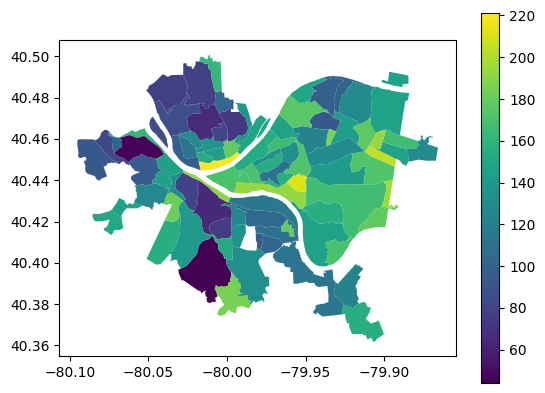

# CMPINF 0010 Final Project
By Large Thoughts (Griffin Hurt [gjh42@pitt.edu] and Brandon Moretti [brm236@pitt.edu])

### Which neighborhood in Pittsburgh is bussin'?

Our project investigates which neighborhood in Pittsburgh has the best access to the Pittsburgh Regional Transportation bus system by looking at ridership, number of stops, and on time percentage.

## The winner was Brookline!

*Lower numbers are better for this visualization.*

### Datasets Used:
1. [List of Pittsburgh Neighborhood Boundaries](https://data.wprdc.org/dataset/neighborhoods2)
    
    This dataset contains the boundaries of each of the Pittsburgh neighborhoods so we can match each of the stops to their respective neighborhood.

2. [Pittsburgh Regional Transit Monthly Average Ridership by Route](https://data.wprdc.org/dataset/prt-monthly-average-ridership-by-route)
    
    This dataset describes the number of people that ride Pittsburgh Regional Transit organized by route.

3. [Pittsburgh Regional Transit Transit Stops](https://data.wprdc.org/dataset/prt-of-allegheny-county-transit-stops)

    This dataset provides information about bus and T stops, including location and available amenities (such as a shelter).

4. [Port Authority Monthly On Time Performance by Route](https://data.wprdc.org/dataset/port-authority-monthly-average-on-time-performance-by-route)

    This dataset details the on time percentage performance for each of the PRT routes.
